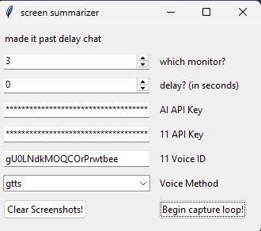
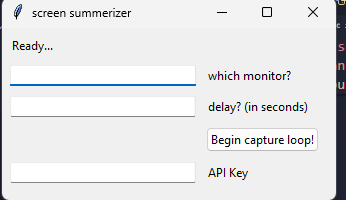

# screen summarizer BETA-POLISH (a branch that will be merged soon!)
## What if you could have the AI stream checker that DougDoug used in one of his [recent popular clips?](https://www.youtube.com/shorts/EYF_fvP8o8M)? 


Well, APPARENTLY YOU ALREADY COULD because halfway through this project I realized that his [github account](https://github.com/DougDougGithub/Babagaboosh/tree/main) is public. BUT I FINISHED MY VERSION ANYWAYS.

This app basically works by looking at one of your monitors (or a virtual monitor using [this repo](https://github.com/VirtualDrivers/Virtual-Display-Driver), which is what I recommend if you don't what summaries of your own screen), sending it to gemini-2.5-flash, sending that output to gTTS (google TTS, aka the Google Translate TTS), then playing it using pygame.

***PLEASE NOTE THAT MOST OF THE CODE IS WRITTEN FOR THE AI.HACKCLUB.COM API KEY PROVIDER. IT HAS NOT BEEN TESTED WITH OTHER TYPES OF API KEYS***
## How can I set it up?

***hey so the releases do not have a release conpiled. the only option is running from source!***

### if you're running from source... 

1. make sure you have python 3.11(.14) installed
2. clone the project
3. install the dependencies (pip install -r requirements.txt)
4. run main.py (python3 main.py)
5. (optional) if you don't want to have to add your API keys every time make a .env file and it will auto fill API keys and Voice ID.

.env format:
```
api_key="your HCAI API key here"
ell_key="your 11 Labs API key here"
ell_voice_id="your 11 Labs Voice ID here"
```


minimal layout recommended:
```
screen-sumerizer
|- screenshots/    // should auto generate now....
|- main.py         // run this one!
|- utils.py        // some helper functions
|- textToSpeach.py // all(most all) the tts code
|- .env            // auto fill your data!

```

### secret bonus guide: compile to .exe from source!
for this, I used nuitka because it was the first one that compiled to a working .exe. basically, once you're finished modifying your code, this is the command I used to compile this.

```
python -m nuitka main.py `
    --mode=standalone `
    --enable-plugin=tk-inter `
    --enable-plugin=pyqt5 `
    --include-package=<copy and paste this line for everything in the requirements.txt> `
    --noinclude-data-file=*.env
```
this will generate 2 folders, main.build and main.dist. the files you likely want are in main.dist.

optionally, you can compress it into one .exe with this command instead, but if the top command doesn't work for you this won't either.
```
python -m nuitka main.py `
    --mode=onefile `
    --enable-plugin=tk-inter `
    --enable-plugin=pyqt5 `
    --include-package=<copy and paste this line for everything in the requirements.txt> `
    --noinclude-data-file=*.env
```

// note, a new version compiled with py2exe will be released soon!

## how do I use this?

### GUI:




top text is a debug log, you can probably ignore that


first number is which display the program will take a screenshot of.


second number is how long to wait between screenshots PLUS time to generate AI response and TTS (so about ~20 more seconds)


the api key. the program will auto input the api key once you press begin capture loop **IF** you have a .env, otherwise you need a:
- Hack Club API key
- 11Labs API key

and even with a correct api key, it can still fail.   // let me know if it does!
some formatting notes:
- don't have api_key= or anything like that
- don't have quotes around the api key
- only have the api key


if you're using 11 Labs, you can copy the voice ID from "My Voices" and use it with your text generation. Put that in 11 Voice ID. (this will also auto-fill from .env if applicable)


for Voice Method, you have a couple of options. 
- gTTS is free, but uses the google translator voice and cannot be changed
- 11Labs can use 20k credits per month, then it won't work without a subscription (this voice is the best)


i personally like 11labs the best because gtts sounds robotic imo but its expensive :C


the button "Clear Screenshots" does what it says. the screenshots the program gets are saved in ./screenshots and aren't deleted so this will remove them.


the button "start capture loop" starts the program! only press it when you're ready, the error handling is questionable at best on the compiled version. if it broke because you pressed the button too many times, maybe a quick restart wouldn't hurt you.


(if you compiled from source run main.py)

### CLI:
the CLI is no longer supported, sorry. you can still find it in the files if you go to an earlier version or the beta branch (testing/main-cli.py) but it lacks proper dirrectory control, TTS other than gTTS, and a lot more. 

to use it, make sure you have a screenshots folder in the same dir and a .env


## expected output
some ai yelling at you in the <chosen voice method> voice every _delay_ seconds!

## does it not work?

Q: 


A:

your api key is invalid!

Q:



A:

your monitor is out of range!

Q: File screenshot not found      // should be impossible to get as an error, lmk if you get this one

A: you don't have a screenshots folder in the project dir!

Q: why is summarizer misspelt everywhere 

it was late when I was first working on it ok


anything else, just let me know or make a issue!


## secret bonus recommendation

if you were to unironically use this software, I'd recommend you set it up on a virtual monitor using [this repo](https://github.com/VirtualDrivers/Virtual-Display-Driver), find out what it was numbered in windows settings, and use it as where you store the thing you want summarized. It keeps it off your main screen, and still renders everything correctly (ahem electron apps). please note this has the same effect as plugging a second monitor into you pc. (if you're having problems with resolution/size of external monitor, change the resolution in windows advanced display settings. it should give you resolution options)

but ohhhh I can't see the other monitor- use obs to capture the other monitor! its still being rendered in the background. (which does mean your mouse will move off screen into it)

***not my work*** but a really cool project that works really well with this one.


another thing, if you aren't happy with the default personality, change "prompt" in main.py (provided you're using the source code edition). this current personality is based HEAVILY on dougdougs ai ([that project](https://github.com/DougDougGithub/Babagaboosh/tree/main)) which i only discovered halfway though but ultimately decided to use it because my ai prompt was NOT working well.

## planned features
- conversation rather than redefining the entire ai every time
- cross platform compatability (don't have a mac so idk about this one...)
- bring back coqui
- dont force 11labs installation
- use ttkbootstrap for nice gui
- error handling
- better install process
- web version? (very unlikely)

## ai use disclaimer
i did use some code generation and some copying from stack overflow for learning the libraries (see the testing folder in the beta branch) and some bugfixing (look coqui has some stupid dependancies). there is probably a small ai code in the main.py from "inline suggestions".


i did not use ai for the readme or commits because im not a shitter.


oh and...
you will be using ai to generate the answers to whats on your screen. this means you are FEEDING AI a picture of your screen, so ***please do not have personal information on screen***.

## and with that, i'm off.
did the main work all in one night with no sleep from midnight to 8am, with some changes at 1pm. i've never felt so burnt out. on the bright side, i have this great screenshot (it was paused for one hour at one point):


the rest of the work was done in the following week and added
- 11labs
- Coqui (only in beta)
- a funny prompt
- file reorg
- requirements.txt
- ok gui

and i removed chrono because it didn't work and i hate pyqqt or whatever its called.

now im done :D