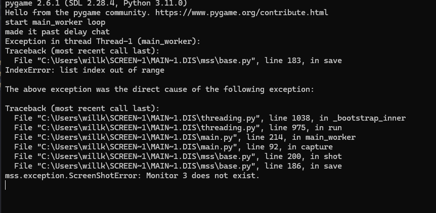

# screen summarizer
## What if you could have the AI stream checker that DougDoug used in one of his [recent popular clips?](https://www.youtube.com/shorts/EYF_fvP8o8M)? 


Well, APPARENTLY YOU ALREADY COULD because halfway through this project I realized that his [github account](https://github.com/DougDougGithub/Babagaboosh/tree/main) is public. BUT I FINISHED MY VERSION ANYWAYS.

This app basically works by looking at one of your monitors (or a virtual monitor using [this repo](https://github.com/VirtualDrivers/Virtual-Display-Driver), which is what I recommend if you don't what summaries of your own screen), sending it to gemini-2.5-flash, sending that output to gTTS (google TTS, aka the Google Translate TTS), then playing it using pygame.

***PLEASE NOTE THAT MOST OF THE CODE IS WRITTEN FOR THE AI.HACKCLUB.COM API KEY PROVIDER. IT HAS NOT BEEN TESTED WITH OTHER TYPES OF API KEYS***
## How can I set it up?

### if you're normal...
extract the zip file from the releases tab
make a screenshots folder in the extracted folder (if its not already there)
run main.exe

### if you're compiling from source... THIS IS THE GUIDE YOU SHOULD FOLLOW IF THERE IS NOT A COMPILED BINARY FOR YOUR OS

1. make sure you have python 3.11 installed
2. clone the project (git clone https://github.com/bouncyblock/screen-sumerizer.git)
3. install the dependencies (pip install gtts pyqt5 pygame requests keyboard mss)
4. run main.py (python3 main.py)
If for some reason if fails with not finding screenshots, make a folder called screenshots in the same folder as your main.py. If you already did that, then try running this command while in the project dir
```
python3 main.py
```
 otherwise it can mess up the paths in the code.       // will be fixed for next version

minimal layout required:
```
screen-sumerizer
|- screenshots/
|- main.py
|- chrono_trigger.git

```

### alt guide for source if you like pain:
Good news! All you need is Python 3.11, a COUPLE pip dependencies:
```
python-dotenv (only for cli ver)
openrouter    (only for cli ver)
gTTS
PyQt5
pygame
requests
keyboard
mss
```
***Also make sure you have a screenshots folder (even if empty), and for your .env file, well...***
```api_key="my gemini-2.5-flash api key here"```
(and you only have to a .env file if you want to use the cli version!)

If for some reason you can't run it after that, please let me know (will.kuntze@gmail.com)! Or open an issue if you want?


### secret bonus guide: compile to .exe from source!
for this, I used nuitka because it was the first one that compiled to a working .exe. basically, once you're finished modifying your code, this is the command I used to compile this.

```
python -m nuitka main.py `
    --mode=standalone `
    --enable-plugin=tk-inter `
    --enable-plugin=pyqt5 `
    --include-package=gtts `
    --include-package=PyQt5 `
    --include-package=tkinter `
    --include-package=pygame `
    --include-package=requests `
    --include-package=mss `
    --noinclude-data-file=*.env
```
this will generate 2 folders, main.build and main.dist. the files you likely want are in main.dist.

optionally, you can compress it into one .exe with this command instead, but if the top command doesn't work for you this won't either.
```
python -m nuitka main.py `
    --mode=onefile `
    --enable-plugin=tk-inter `
    --enable-plugin=pyqt5 `
    --include-package=gtts `
    --include-package=PyQt5 `
    --include-package=tkinter `
    --include-package=pygame `
    --include-package=requests `
    --include-package=mss `
    --noinclude-data-file=*.env
```
## how do I use this?

### GUI:


alright, here we go.
the top text is a debug log, but its only one line. Just because nothing changes immediately after pressing begin capture loop does not mean its broken. it depends on your delay

first input line is which display do you want to be capturing. you can find number identifications in any display settings you bios has. THIS NUMBER IS 1 INDEXED. IF YOU PUT 0 IN, YOU DONT HAVE 0 MONITORS (or if you do then I don't know why you're using this program)

second input line is delay between screenshots. this number will be ADDED onto however much time it takes to finish the tts

the button starts the program! only press it when you're ready, the error handling is questionable at best on the compiled version. if it broke because you pressed the button too many times, maybe a quick restart wouldn't hurt you.

finally, the api key. the program will silently fail without the api key, and even with a correct api key, it can still fail.
some formatting notes:
- don't have api_key= or anything like that
- don't have quotes around the api key
- only have the api key

(if you compiled from source run main.py)

### CLI:
wow! I can't believe you're using source just to use cli! there's only one option for the CLI version though, monitor number, and you'll be prompted for that.
otherwise just run the python file (main-cli.py). it has SLIGHTLY less features than the GUI version.


## expected output
some ai yelling at you in the google translator voice every _delay_ seconds!
(oh and chrono from chrono trigger as the ai) // this only works with the source code version

## faq

Q: 


A:

your api key is invalid!

Q:



A:

your monitor is out of range!

Q: File screenshot not found

A: you don't have a screenshots folder in the project dir!

Q: why is summarizer misspelt everywhere 

it was late ok


## secret bonus recommendation

if you were to unironically use this software, I'd recommend you set it up on a virtual monitor using [this repo](https://github.com/VirtualDrivers/Virtual-Display-Driver), find out what it was numbered in windows settings, and use it as where you store the thing you want summarized. It keeps it off your main screen, and still renders everything correctly (ahem electron apps). please note this has the same effect as plugging a second monitor into you pc. (if you're having problems with resolution/size of external monitor, change the resolution in windows advanced display settings. it should give you resolution options)

but ohhhh I can't see the other monitor- use obs to capture the other monitor! its still being rendered in the background. (which does mean your mouse will move off screen into it)

***not my work*** but a really cool project that works really well with this one.


another thing, if you aren't happy with the default personality, change "prompt" in main.py (provided you're using the source code edition). this current personality is based HEAVILY on dougdougs ai ([that project](https://github.com/DougDougGithub/Babagaboosh/tree/main)) which i only discovered halfway though but ultimately decided to use it because my ai prompt was NOT working well.

## planned features
- better voice
- better personality
- correct rendering of chrono on the screen
- conversation rather than redefining the entire ai every time
- cross platform compatability (don't have a mac so idk about this one...)
- maybe window capture? 
- maybe obs support?

## ai use disclaimer
i did use some code generation and some copying from stack overflow for the example flies and some bugfixing. there is probably ai code in the main.py file because if I can reuse a block of code i will.
i did not use ai for the readme or commits.

oh and you use ai to generate the answers to whats on your screen

## and with that, i'm off.
did this all in one night with no sleep from midnight to 8am, with some changes at 1pm. i've never felt so burnt out. on the bright side, i have this great screenshot (it was paused for one hour at one point):

